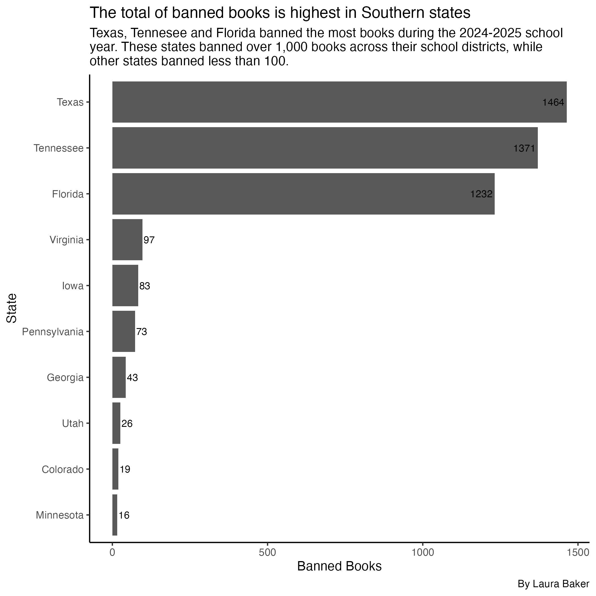
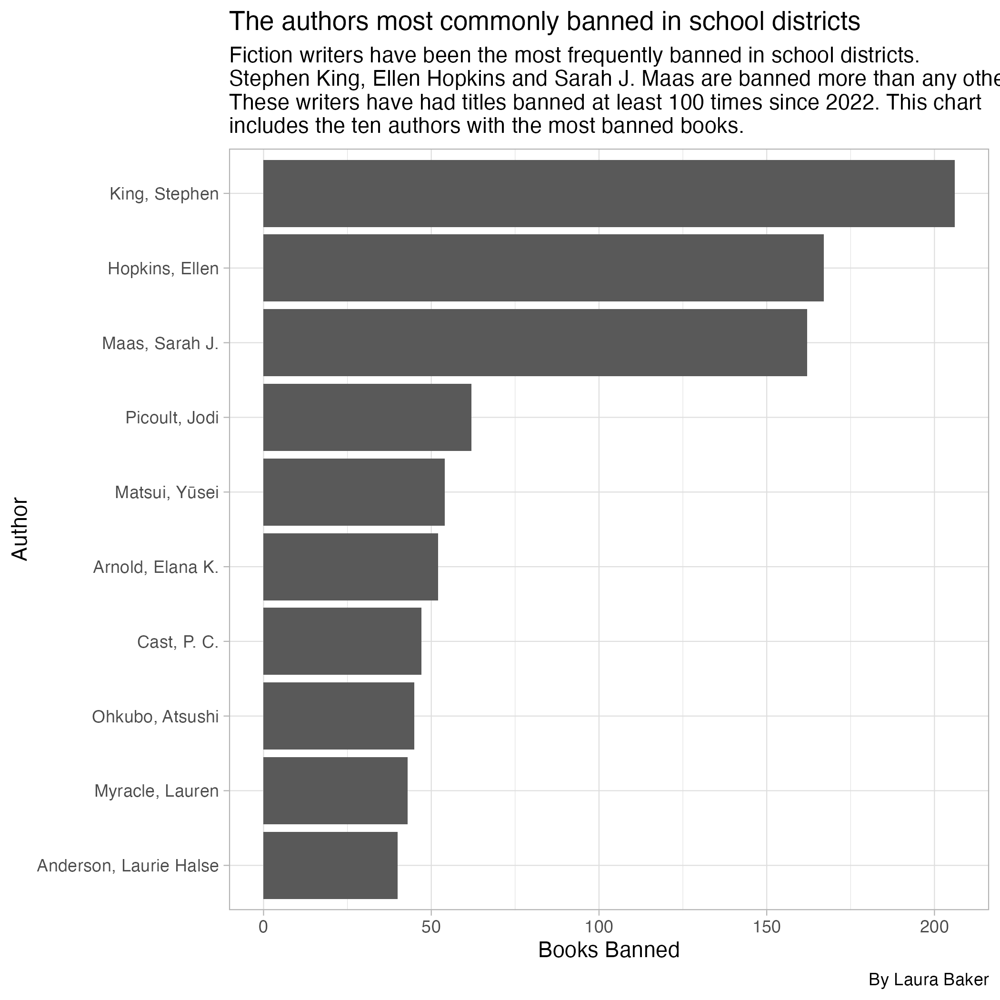

Texas and Florida continue to account for the largest share of book bans nationwide, with several high-profile authors repeatedly removed across school districts between the 2021 and 2025 school years. 

These states most consistently banned the highest amount of books during each school year. Florida banned a collective 4,232 titles between 2022 and 2025, which is over 1,000 more than any other state. Texas ranked second with a collective 2987 banned titles. 

This analysis explores books banned in Texas school districts, school systems across U.S. states and issued statewide bans. It uses data from the PEN America Index of School Book Bans between 2021 and 2025, as well as Census Reporter's total populations between 2019 and 2023. (https://pen.org/book-bans/pen-america-index-of-school-book-bans-2023-2024/; https://pen.org/book-bans/banned-book-list-2021-2022/; https://pen.org/book-bans/pen-america-index-of-school-book-bans-2024-2025/;
https://censusreporter.org/data/table/?table=B01003&geo_ids=04000US48,040%7C01000US&primary_geo_id=04000US48).

This is the final project for the University of Texas at Austin's Reporting with Data in R course at the Moody School of Communication's School of Journalism and Media. 

During the 2023-2024 school year, 4561 books were banned across all school districts in Texas. Iowa had the second highest amount of book bans during the 2023-2024 school year with 3671 bans. This was also the second highest number of bans for a state in a single school year. 

Texas, Tennessee and Florida consistently banned the most books throughout the four school years documented. Texas had the highest number of total bans, with just nearly 100 more books banned than Tennessee.

During the 2022-2023 school year, Florida banned more books than any other state with 1406 bans. This is more than double the amount books Texas banned during that year. Districts across Texas banned 625 books that year, despite the state having a population with nearly 8 million more people according to the 2019-2023 census data.

North East Independent School District had more bans than any other district during the 2024-2025 school year with 752 titles banned. Many districts had years with only one book banned including Jacksonville Independent School District, Lake Travis Independent School District, Waller Independent School District and Highland Park Independent School District. Highland Park Independent School District was the only district in Texas to ban one book during the 2024-2025 school year.

Ellen Hopkins, Sarah J. Mass and Stephen King have been the top three most commonly banned authors between the 2021 and 2025 school years. Ellen Hopkins has the most banned titles, with books that have been banned 435 times across school districts nationwide. Sarah J. Mass' books have been banned 338 times, and Stephen King's books have been banned 219 times across all school districts. 

Elle Hopkins is also the most banned author in Iowa and Texas. In Iowa her books have been banned 295 times, accounting for the greatest number of bans for particular author in a single state. Her books have been banned 117 times in the Texas since 2021. 

During the 2023-2024 school year, "Nineteen Minutes" by Jodi Picoult was the most banned book. The book received 98 bans, more than any single book received in any other school year. That year, "Looking for Alaska" by John Green was banned 97 times. Overall, the 2023-24 school year saw the highest proportion of book bans for individual titles, including classics such as "The Handmaid's Tale" and "The Kite Runner."

It is important to note that book-ban definitions vary by district, and PEN America counts both temporary removals and permanent withdrawals. Because reporting practices differ by state, actual totals may be higher than documented. Additionally, bans do not necessarily reflect student readership or curricular emphasis, and large districts naturally record higher counts due to their size. Additionally, the census data tracks the population between 2019 and 2023 per state, not school districts. A more direct comparison would consider the population of students across school districts exclusively.  
